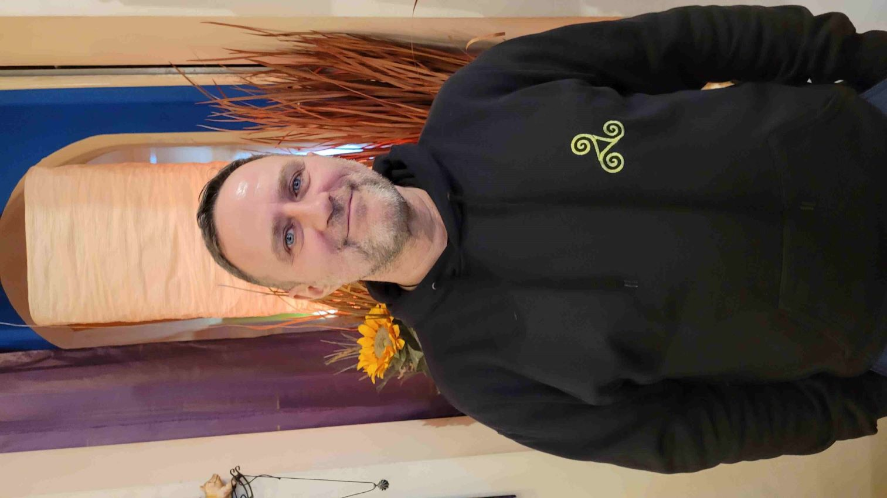

+++
title = "Interview"
date = "2024-03-16"
draft = false
pinned = false
tags = []
image = "20240302_160652.jpg"
description = "Interview mit Wilhelm Haas, einem Wicca-Priester"
+++

# **Im Bannkreis der Magie**

## **Gespräch mit Wilhelm Haas über moderne Hexen, Kelten, Götter und die Zwischenwelt.**

**Wilhelm Haas ist eine bekennende Hexe. Er hat mir erzählt, wie er seinen Weg in die Wicca-Bewegung gefunden hat und was Magie im 21. Jahrhundert für ihn bedeutet.**\
\
Ich treffe Wilhelm Haas in seinem Laden «Zwischenwelt» in Luzern. Ein Sammelsurium von spirituellen Symbolen, Runen, Bücher und Räucherwerken umgibt uns. Es riecht nach Räucherstäbchen.

<!--StartFragment-->



<!--EndFragment-->

**Wilhelm, hast du heute schon Magie gewebt?**\
Das ist die erste Frage, die ich gesehen habe – bewusst Magie gewebt heute nicht, unbewusst weben wir alle zwischendurch Magie**.**

<!--StartFragment-->



<!--EndFragment-->\

**Wie lange führst du deinen Laden bereits?**\
Seit 2001. http

s://www.zwischenwelt.ch/

**Hat sich im Verlauf der Jahre die Art und Anzahl der Kundschaft verändert?**\
Ich würde sage, es hält sich im Gleichgewicht. Es hängt davon ab, was spirituell gerade «in» ist. Zu Beginn haben sich mehr Leute für Wicca interessiert, da war gerade ein Boom durch die TV-Serie «Charmed» und die Bücher von «Harry Potter». Ich habe aber eine sehr durchmischte Kundschaft.\
**\
Kommen auch Mythologen oder Mythologie-Interessierte vorbei?**\
Es kommen Personen vorbei, die sich für Mythologie interessieren. Ob Mythologen dabei sind, weiss ich nicht, weisst du, die würden mir das nicht sagen (lacht).\
**\
Du nennst dich eine progressive Hexe – was darf man darunter verstehen?**\
Progressiv ist für mich, dass ich nicht mehr zu sehr den Dogmatismen und der Tradition folge, die ich gelernt habe. Ich habe meinen eigenen Weg entwickelt. Bin offen für Technik, Modernes. Ich finde, Hexentum sollte nicht nur wie früher gelebt werden.

\
**Also, so ein bisschen dieses archaische?** \
Genau, also dieses archaische ist immer gut, aber wir leben im 21. Jahrhundert. Ich finde Magie und Hexentum ist Kreativität und lebt von der Kreativität der Zeit, in der man lebt.\
**\
Wann in deinem Leben hast du begonnen, dich mit dieser Art von Spiritualität auseinanderzusetzen? Gab es einen Auslöser?**\
Mit 18 Jahren habe ich das Buch «Die Nebel von Avalon» gelesen. Das war für mich der erste Auslöser. Darin kamen eine Göttin und Kelten vor. Das hat mich sofort angesprochen. 1998 habe ich in Amerika gelebt und in einer Talkshow eine Priesterin der Wicca-Bewegung gesehen. Sie hat ihren spirituellen Weg beschrieben und da hat es bei mir «boing, boing» gemacht. Ich wusste, das ist mein Weg, den ich einschlagen möchte. Ich begann mich mit dem Thema auseinanderzusetzen und bin schnell mit Gleichgesinnten in Berührung gekommen. Auch hatte ich das Glück einen Coven (Hexenzirkel, Anmerkung Redaktion) zu finden, wo ich lernen konnte. **\*\***\
Im Zuge meiner Recherchen habe ich gelesen, dass du im katholischen Wien aufgewachsen bist. Welchen persönlichen Bezug hattest du zur Kirche?\*\*Das sind so Wellenbewegungen. Als Kind wollte ich sogar Priester werden, die Rituale haben mich fasziniert. Weihrauch habe ich geliebt. Meine Eltern haben mich in eine katholische Pfadfinder-Jugendgruppe geschickt und dort hatte man für meine Interessen kein Verständnis. Es wurde behauptet, dass sei alles dämonisch und böse. Da bin ich etwas ins Straucheln gekommen. Ich war sowieso ein bisschen anders, immer schon etwas der Aussenseiter und dann bekam ich «die Offenbarung» in die Hand gedrückt zum Lesen. Das war nicht unbedingt die beste Lektüre. Daraufhin habe ich begonnen mich über die Kirche zu informieren, habe Bücher gelesen über die Entstehungsgeschichte und habe schnell gemerkt, dass mir das nicht zusagt.

**\
Der strikte Monotheismus?** \
Der hat mir nie zugesagt. Ich hatte schon in der Schule Probleme, weil ich immer gefragt habe, wieso Gott eigentlich unbedingt ein Mann sein muss. Als ich bei Wicca eingestiegen bin, kam da ein kleiner Revoluzzer Trieb zum Vorschein, wo ich dachte, die Kirche ist schlecht. Aber mit der Zeit habe ich gelernt, dass auch bei der Kirche nicht alles schlecht ist. Ich sage mal so, es gibt Leute, die «schlecht» sind. Auf der anderen Seite wurde ich an Universitäten eingeladen und habe vor Theologen und Studenten Vorträge gehalten. Es sind eher die Freikirchen, die fanatisch sind.

**Und wie reagieren die Leute in deinem Umfeld auf deine Lebensweise?**\
Ja, gut. Ich bin privat so, wie ich bin. Ich renne natürlich nicht herum mit einer Fahne, wo draufsteht «ich bin eine Hexe und alles ist Magie». Für die bin ich einfach der Willi. Es ist klar, manchmal fragen sie mich um Rat oder ob ich ihnen eine Kerze oder eine Flasche Ritualwein mache. Ich habe viele atheistische Kollegen. Die haben auch kein Problem damit. Schliesslich wissen sie, dass ich mich schon immer dafür interessiert habe.

**Was ist der tiefere Sinn des Namens deines Ladens «Zwischenwelt»?**\
Ah, das ist eine coole Frage. In letzter Zeit kommen immer wieder Leute zu mir, die das Gefühl haben, es habe etwas mit dem Fegefeuer zutun. Das stimmt nicht. Der Gedanke, den ich mir gemacht habe ist, dass wir als Wicca einen heiligen Raum schaffen. In unseren Ritualen ziehen wir Kreise und schaffen eine Sphäre. Dazu sagen wir «es ist ein Raum, der sich zwischen den Welten befindet». Du bist im einen in der Realität, aber du schaffst quasi wie einen heiligen Raum, wo du den Übertritt in andere Bewusstseinszustände oder in eine Anderswelt machst. Für mich ist diese Sphäre die Zwischenwelt. Deshalb habe ich den Laden auch so genannt.

**Was sind Wiccas genau und womit beschäftigen sie sich in Bezug auf Traditionen, Gemeinschaft und Rituale?** \
Ja, das ist ein bisschen eine schwierige Frage, die ich nicht so einfach beantworten kann, weil sich Wicca extrem verändert hat, seitdem ich damit begonnen habe. Wicca war am Anfang eine initiatorische Tradition, wo wirklich nur von Zirkel zu Zirkel zu Zirkel gegangen ist. In den 70er und 80er Jahren begann die Veränderung unter anderem durch diverse Publikationen und die Feministenbewegung. Heute bei den jungen Leuten, den sogenannten «Tiktok-Witches» wird Wicca eher etwas herunter gemacht, weil es angeblich dogmatisch sei.\
Ich würde sagen, der Grundstein ist eigentlich die Verbindung mit dem Göttlichen herzustellen. Die Form dafür ist sehr individuell. Rein theoretisch sollte man immer noch, wenn man sich Wicca nennt, gleichwohl verschiede Zonen durchlaufen und sei es nur, dass man sich selbst initiiert, sich selber findet in sich.\
**\
Also, ist das Wiccatum ohne eine gewisse Hierarchie?**\
Die gibt es innerhalb von Coven. In einem traditionellen Coven gibt es Hohenpriesterinnen und Hohenpriester als Leiter. Es gibt aber auch Coven die unhierarchisch arbeiten.

**Bemerkst du gesellschaftliche Veränderungen in der Wahrnehmung der Wiccas speziell in der Schweiz?**\
Ich finde, dass seit Corona die Leute ein bisschen abergläubischer geworden sind. Als ich meinen Laden aufgemacht habe, wollte ich zeigen, dass Hexentum ein progressiver Weg ist, wo man an sich arbeitet, und das klingt wohl kitschig, aber versucht ein besserer Mensch zu werden. Schwarz-weiss Denken, schwarze Magie, weisse Magie, Gut und Böse, dass das meines Erachtens nicht stimmt. Aber seit ein paar Jahren beginnen generell Leute, nicht nur Wiccas, wieder mit diesen Meinungen «das ist falsch», «das ist gut», das ist «böse» und sie vergessen immer mehr die Grautöne zwischendurch und die Farben. Aber das ist eine gesellschaftliche Veränderung und betrifft nicht nur die Wiccas.\
\
**Also mit dem steigenden Interesse, was ich so ein bisschen herausinterpretieren kann, trifft das auf alle Altersgruppen zu oder auf spezifische?** \
Es gibt die ganz junge Generation, Gen-Z, die sich mit Wiccatum beschäftigt vor allem in Amerika und über Tiktok. Übrigens ist Witchtok einer der am meisten gesehenen Hashtags. Meiner Meinung nach ist dieser Zugang ein bisschen oberflächlich. Es geht mehr um «ich kann Magie wirken», «ich kann auch Schaden anrichten» und «das ist mein Recht, dass ich das tue». Leider ist «ein guter Mensch sein» momentan nicht «in» und «traditionell sein» auch nicht. Ich glaube, die meisten verstehen gar nicht worum es bei Wicca geht. Trotzdem, wenn ich dort zuschauen, nutzen sie fast alle Techniken, z.B. Elemente aufrufen, aus dem Wicca. Also, sie ziehen über Wicca her, aber nutzen die Wicca Techniken in der eigenen Praxis, das ist für mich halt ironisch.

**Was mich interessiert, gibt es eine starke Beziehung der Wiccas zu der keltischen Mythologie?** \
Das Keltentum hat sicher einen grossen Einfluss gehabt, aber nicht nur. Es gibt Wiccas, die arbeiten mit der nordischen Tradition, andere arbeiten nicht mit der Mythologie, sondern mit «great God is great God» oder «Lord und Lady» und andere wollen nicht im Fundus der Vergangenheit wühlen. Ursprünglich hat das Keltentum, durch die Avalon Legende, Glastonbury, etc., sicher einen grossen Einfluss gehabt. Das Buch «Die Nebel von Avalon» war damals ein Beststeller. Das hatte sicher einen grossen Input. Also, es hat einen Impakt, aber Wicca ist mit dem Begriff Keltentum nicht fix verknüpft.\
\
**So wie ich das jetzt verstanden habe, ist das Wiccatum stark vom keltischen und auch vom germanischen geprägt.** \
Ich würde sagen, sogar am meisten, zum Beispiel der Jahreskreis mit seinen 8 Festen, das ist nicht so kohärenter Jahreskreis gewesen. Die Kelten sowie die Germanen haben ein paar Feste besonders hoch gefeiert und Gerald Gardner (Begründer des [Gardenischen-Wicca](https://de.wikipedia.org/wiki/Gardenisches_Wicca "Gardenisches Wicca"), Anmerkung Redaktion) hat daraus den Jahreskreis mit den 8 Festen zusammengefasst. Als Gerald Gardner anfing mit «Lord und Lady» zu arbeiten, hat er sich interessanterweise an den nordischen Gottheiten «Freyr und Freya» orientiert. Ich würde es mal so sagen, das Wiccatum ist ein Schmelztiegel geworden

**Kennst du auch Anhänger anderer mythologischen Lehren, z.B. Neohellenismus, Kemetismus?** \
Ich kenne hellenistisch-arbeitende Kollegen in Deutschland, aber nur über das Internet. Ich habe immer wieder Schülerinnen und Schüler, die sich für die griechische Mythologie interessieren. Das war auch die erste, mit der ich mich beschäftigt habe.

**Also, ist das auch hier individuell geprägt?**\
Genau, wo irgendwo ein Mythos auf dich wirkt. Ich sage es mal so: «man spürts». Meine erste Begegnung mit den Kelten war: «aaah, wow, da gibt es noch etwas!». In der Schule habe ich nichts darüber gelernt.

**Wie unterscheidet sich der Wicca-Kult hauptsächlich von den abrahamitischen Weltreligionen?**\
Dadurch, dass es vor allem keine Zentralstelle gibt, die dir vorschreibt, was du zu tun hast. Dann eben, dass Wiccas mit dem Götterbild arbeiten, von dem sie sich angesprochen fühlen. Also, wir haben keine Gottheit, die zentral oben steht. Vor allem aber, dass dem Weiblichen in Wicca einer grosser, ursprünglich sogar einem grösseren Wert zugesprochen wurde als dem Männlichem. Das heisst, die Göttin war immer ein Faktor in Wicca. Das weiblich-göttliche findet man in abrahamitischen Religionen nicht mehr so.

**Also kann man sagen, dass jede Wicca ihre Lieblingsgottheit hat?**\
Ich würde nicht sagen Lieblingsgottheit, das klingt so, als würde man einen Star anhimmeln. Wir beten unsere Götter nicht an, nicht so wie im Katholizismus. Sie sind von uns ein Teil in der Welt, sind auch ein Teil von uns selber und gleichwohl erfahrbar in anderen Realitäten.

**Woran erkennen sich Wiccas? Zum Beispiel an Amuletten oder Tätowierungen? Oder ist dies eher ein Klischee?**\
Ja, das ist ein Klischee. Es gibt viele Leute, die mit nordischen oder keltischen Symbolen tätowiert sind, ohne damit sie etwas besonderes verknüpfen. Ich hatte letztens eine Handwerkerin unten im Keller gehabt, bei uns im Haus, und sie hat ein Amulett mit Runenpentagramm getragen. Da habe ich sofort reagiert und gesagt, ich kenne dieses Amulett. Dadurch sind wir ins Gespräch gekommen. Sie hat meinen Laden auch gekannt (lacht).

**Braucht es ein Aufnahmeritual um Wicca zu werden?**\
Die Frage ist, ob du einem Coven beitreten möchtest, respektiv in einem Zirkel eine Ausbildung machst. Dann bist du eine Zeit lang dabei und wenn die anderen das Gefühl haben, dass passt, dann durchläufst du ein Aufnahmeritual. Dann hast du die erste Initiation und gehst den offiziellen Weg und dort drin kannst du bis zur Priesterschaft aufsteigen.

**Welche Bedeutung haben Wälder für dich? Gibt es dort spezielle Kraftorte?**\
Kraftorte finde man überall, sogar in der Stadt, dass vergessen viele. Auch Kirchen sind oft an Kraftorten gebaut. Ich spüre wie es vibriert. Aber die freie Natur ist absolut unschlagbar. Draussen den Kontakt zu knüpfen, sich wieder zu besinnen, den Ursprung des Lebens, das Göttlich eben, das ist schon etwas Besonderes. Gewisse Orte pulsieren. Der Pilatus zum Beispiel ist ein heiliger Ort, der hat besonders starke maskuline Energie. Die Rigi, wenn ich dort rauf gehe, spüre ich die eher weichere, femininere Energie.\
Im Wald hat es viele Linien und Ort, wo ich spüre, da tut sich etwas. Und es ist wie überall im Leben, manchmal fühlt es sich gut an und manchmal merkst du, jetzt bist du nicht willkommen. Die Energie wird anders.

**Reist du gerne an Orte, wo Kräfte herrschen, wie Stonehenge oder Gise?**\
Ich würde sehr gerne reisen, aber seit ich meinen Laden habe, komme ich nicht mehr so oft raus. Ich habe Familie in England und war bei einem Besuch auch im Nottingham Forest. Der hat eine extreme Energie. Unsere Avalonreise haben wir verschieben müssen, wegen Corona. Sehr gerne reise ich auch in der Schweiz. Gerade im Alpenraum hat es viele Kraftorte. Es ist nicht nötig immer in die Ferne zu reisen, um heilige Orte aufzusuchen. Es gibt hier genug heilige Orte, wir müssen diese nur entdecken und würdigen.

**Haben Wiccas Einfluss auf das Geschehen in ihrer Umgebung? Sind sie in der Lage Energien zu kanalisieren?** \
Wenn man im magischen Bereich arbeitet, dann lernt man Energien zu leiten, zu fokussieren oder in die richtige Richtung zu senden. Ich finde, das ist nicht unbedingt wicca-abhängig, das kann jeder Mensch, der sich damit beschäftigt machen.

\
**Also jeder Einzelne kann dazu beitragen?**\
Absolut ja. Aber der Einfluss auf die Welt ist immer ein bisschen schwierig. Als junger Idealist habe ich mir schon gedacht, ich könnte die Welt ein bisschen verändern, wenn man Leute zum Nachdenken anregt, heute sage ich mir, nein, das geht nicht, aber ich kann ein Vorbild sein.

**Viele Menschen treten aus den traditionellen Kirchen aus und sind auf der Suche nach eigener, ungebundener Spiritualität. Worauf kannst du das zurückführen?** \
Ich denke, viele Menschen kommen nicht mehr damit zurecht, was gesetzmässig gepredigt oder gemacht wird. Heutzutage lassen sich die Leute keine Vorschriften mehr machen. Sie erkennen auch das frauenfeindliche, die Rolle der Frau sowie die Haltung der Kirche zu Homosexualität. Dies ist nicht mehr zeitgemäss und es entspricht auch nicht dem Natürlichen. Zudem denke ich, dass viele Rituale die Menschen nicht mehr ansprechen.

**Das ist faszinierend, wenn man bedenkt, dass diese Religion, die Vorläufer oder Inspirationen, die bei heutigen Bewegungen wie den Wiccas beispielsweise, auf so alte Religionen und Traditionen zurückgehen.** Wicca ist eine moderne Religion, die einen eklektischen Pfad geht. Da wurde Ritualistik aus der rohen Magie, aus der Zeremonialmagie übernommen und abgeändert. Es ist ein Mischmasch aus alten und okkulten Religionen. Es geht um den Versuch die Naturspiritualität mehr zu integrieren, aber auch den Schamanismus und die Hexenzirkel.

**In Gesprächen mit Menschen in meinem Umfeld wird dem Thema Paganismus mit Vorurteilen, wie Blutopfer oder Hexerei, begegnet. Wie kann man dazu beitragen diese Vorurteile zu entkräften?**\
Menschen, die Vorurteile haben, sind oft streng religiös. Sie werden die Sachen immer verteufeln, weil sie es so gelernt haben und weil sie alles was nicht mit Gott zu tun hat, aufgrund der kirchlichen Lehre automatisch nicht gut finden. Pagans (Heiden, Anmerkung Redaktion) sind alle nicht gottgläubigen, im christlichen Sinne, also für Katholiken sind sogar Hindus Pagans, weil es nicht dem christlichen Glauben entspricht.\
Wir opfern oft Blumen, Trankopfer sowie Speiseopfer oder wir spenden als Opfer an Greenpeace oder gemeinnützigen Organisationen. Aber es wäre völlig gegen unsere Wiccatradition, wenn ein Lebewesen verletzt, gequält oder getötet würde. Wir haben nicht viele heilige Texte, aber einer davon ist die bekannte «Charge of the Goddess». Dort steht, dass es keine Opfer braucht, «weil alles was lebt und alles was da ist, ist ein Teil von mir». Grundsätzlich lieben die Heiden die Natur, die Tiere. Es gibt Rituale, da legen wir einfach Nüsse ab oder Ritualweine werden der Erde übergeben. Letztendlich Vorurteile wird es immer geben.

**Viele Menschen assoziieren Hexerei mit Katzen. Hast du eine Katze?**\
Leider nicht mehr. Ja, ich hatte Katzen und ich liebe Katzen. Die Letzte ist vor zwei Jahren ins Sommerland gezogen. Alle meine Katzen sind aber sehr alt geworden. Also, ich liebe auch Hunde und Meerschweinchen, aber Katzen haben tatsächlich einen anderen Zugang zur Anderswelt. Wenn ich Besuch aus anderen Welten hatte oder etwas Magisches gearbeitet habe, das ist jetzt wieder ein Klischee, Luna, eine schwarze Katze, die hat das gespürt. Die war drei Zimmer weiter und ich habe begonnen in meinem Raum zu visualisieren, Elemente begrüsst, die ist aufgesprungen, kam rein, hat sich hingesetzt und mir zugeschaut. Wenn ich einen schlechten Traum hatte oder von einer unfreiwilligen Ermessensreise zurückgekommen bin und etwas mitgenommen haben, die Katzen habe das gesehen. Alle drei waren auf dem Bett und haben hingestarrt. Katzen haben einen anderen Draht. Hunde übrigens auch, dass wird oft unterschätzt, aber Hunde drücken es wahrscheinlich anders aus.