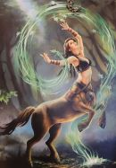

+++
title = "Reportage"
date = "2024-03-16"
draft = false
pinned = false
image = "gottini.jpg"
+++
# Zu Besuch in der "Zwischenwelt"

## **Wicca bewegt - ein Mysterium durchwoben von zauberhafter Magie**

Tauchen Sie ein in die Welt der modernen Hexen: Eine Reise durch die keltische Mythologie, die Verehrung der Götter und die geheimnisvolle Zwischenwelt"\
\
Auch im 21. Jahrhundert wird noch Magie gewebt. Schätzungsweise rund 5000 Hexen leben in der Schweiz. Sie leben ihre Kunst meist im Verborgenen aus. Wilhelm Haas ist Anhänger der Wicca-Religion und betreibt einen Hexenladen in Luzern.